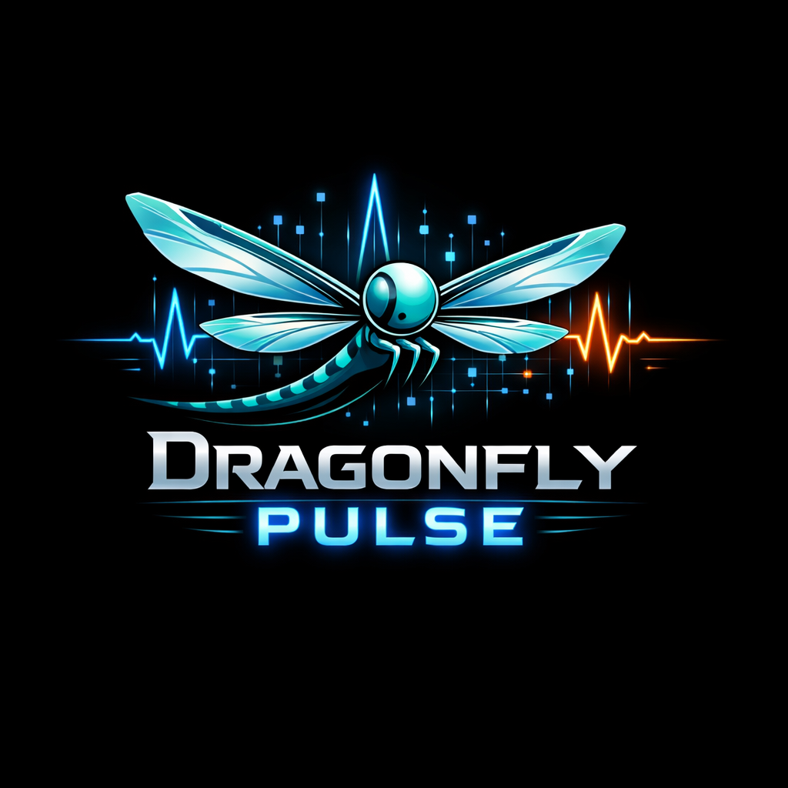

# Dragonfly Pulse



[](https://github.com/Thedan-1/Dragonfly-Pulse/actions/workflows/ci.yml)
[](LICENSE)
[](pyproject.toml)

校园科技赛雷达。自动汇总竞赛官网公告，抽取关键时间信息，提供可搜索 API，帮助学生和老师减少信息差。

## 功能总览

| 模块 | 现在可用能力 |
| --- | --- |
| Crawler | 多站点抓取、候选公告页发现、URL 去重 |
| Extractor | trafilatura + readability + 纯文本回退 |
| Structuring | LLM 优先抽取，规则引擎回退 |
| Database | 来源表、公告表、来源健康评分表 |
| API | `/health` `/sources` `/announcements` `/sources/health` |
| MCP | 提供工具接口骨架（Python 3.10+） |

## 快速开始

```bash
pip install -r requirements.txt
cp .env.example .env
PYTHONPATH=src python scripts/init_db.py
PYTHONPATH=src python scripts/run_daily.py
```

可选命令：

```bash
PYTHONPATH=src python scripts/run_api.py
PYTHONPATH=src python -m pytest -q
```

## 配置说明

### 1) 竞赛来源配置

在 `config/sources.yaml` 增加来源即可接入新比赛。

关键字段：

| 字段 | 说明 |
| --- | --- |
| `competition_name` | 比赛名称 |
| `homepage` | 官网首页 |
| `announcement_page` | 公告主入口 |
| `list_page_hints` | 公告列表页路径提示 |
| `article_keywords` | 标题关键词过滤 |

### 2) 环境变量

| 变量 | 默认值 | 作用 |
| --- | --- | --- |
| `DATABASE_URL` | `sqlite:///competition_intel.db` | 数据库连接 |
| `REQUEST_TIMEOUT` | `15` | HTTP 超时 |
| `HTTP_RETRIES` | `2` | 重试次数 |
| `HTTP_BACKOFF_SECONDS` | `1.0` | 重试退避 |
| `OPENAI_API_KEY` | 空 | LLM 抽取密钥 |
| `OPENAI_MODEL` | `gpt-4o-mini` | 模型名称 |
| `OPENAI_BASE_URL` | `https://api.openai.com/v1` | 兼容接口地址 |

## API

| 方法 | 路径 | 说明 |
| --- | --- | --- |
| GET | `/health` | 服务健康检查 |
| GET | `/sources?keyword=` | 来源列表/搜索 |
| GET | `/announcements?limit=&offset=&competition_name=&keyword=` | 公告查询 |
| GET | `/sources/health?limit=` | 来源健康评分 |

## 兼容性

| 能力 | Python 版本 |
| --- | --- |
| 核心抓取 + API | 3.9+ |
| MCP 官方 SDK | 3.10+ |

## 文档导航

- 架构说明: `docs/ARCHITECTURE.md`
- 目标范围: `docs/TARGET_SCOPE.md`
- 集成说明: `docs/INTEGRATIONS.md`
- API 合约: `docs/API_CONTRACT.md`
- 发布说明: `docs/RELEASE_NOTES_v0.1.0.md`
- 变更日志: `CHANGELOG.md`

## 开源协作

- License: MIT (`LICENSE`)
- Contributing: `CONTRIBUTING.md`
- Code of Conduct: `CODE_OF_CONDUCT.md`
- Security: `SECURITY.md`

核心贡献者：Thedan-1
